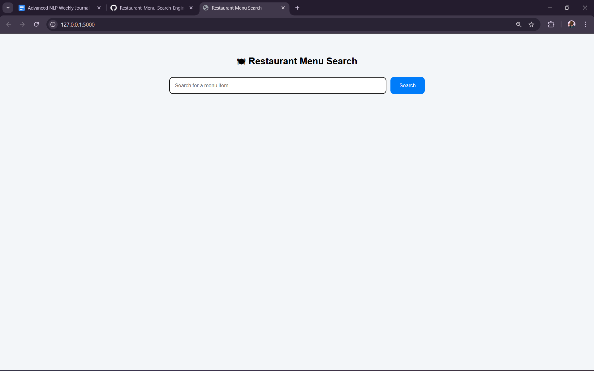
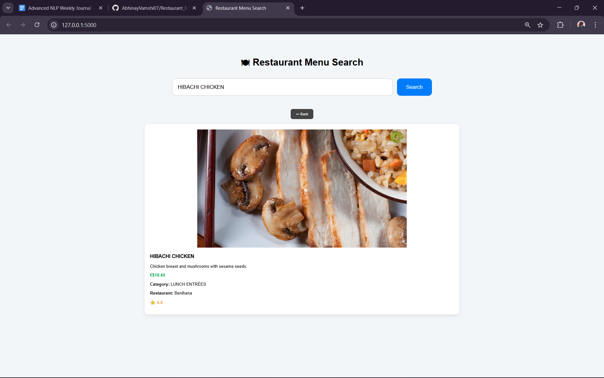
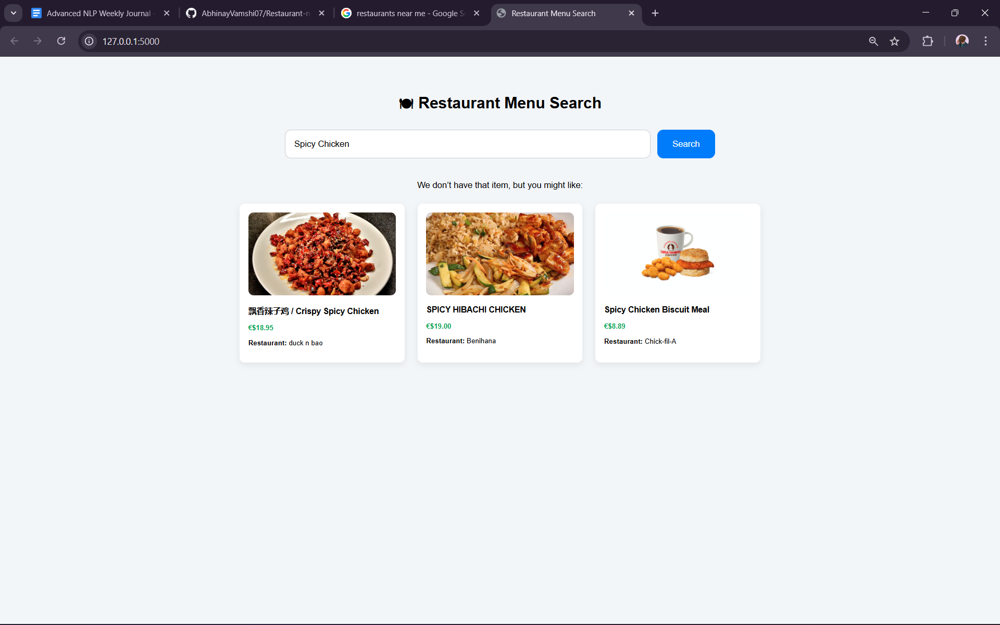
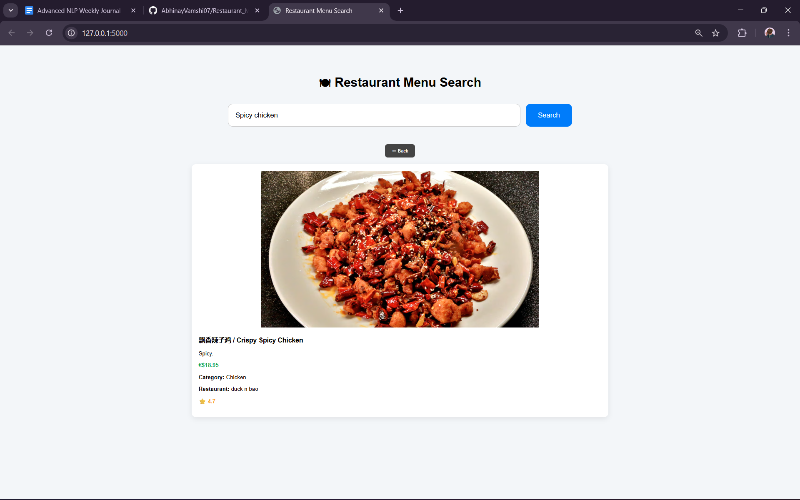
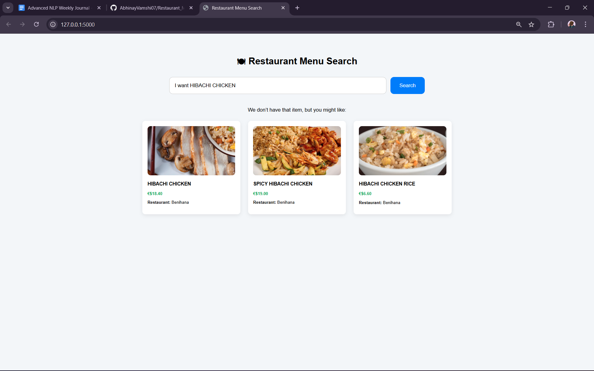

# Restaurant Menu Search Engine

A keyword-based restaurant menu search engine built using TF-IDF and cosine similarity, implemented with a Flask backend and dynamic web interface.

---

## Project Overview

This project implements a restaurant menu search engine using classical vector space modeling techniques. The objective was to evaluate how well traditional lexical matching performs in a real application before transitioning toward more advanced semantic or LLM-based approaches.

The system retrieves either exact matches or ranked similar recommendations based on term frequency and cosine similarity.

---

## Search Interface

The application provides a clean search interface where users can enter a menu item query.

  

---

## Exact Match Retrieval

If the user query exactly matches a menu item after preprocessing, the system directly displays the complete item details including:

- Image  
- Description  
- Price  
- Category  
- Restaurant  
- Rating  
- Back button for navigation  

  

---

## Similarity-Based Recommendations

If no exact match is found, the system converts the query into a TF-IDF vector and computes cosine similarity against all menu items. The top three most similar items are returned as recommendations.

  

Each recommended item is clickable and loads a detailed item view.

---

## Item Detail View

When a recommended item is selected, a detailed page is displayed showing:

- Large item image  
- Description  
- Price  
- Category  
- Restaurant  
- Rating  
- Back button for returning to results  

  

---

## Natural Language Query Limitation

The system struggles with conversational queries such as:

"I want HIBACHI CHICKEN"

Since TF-IDF relies purely on lexical overlap, additional words reduce similarity scores even when the user intent is clear.

  

---

## Observed Limitations

- No understanding of user intent  
- Cannot handle paraphrasing  
- Sensitive to extra words  
- No synonym awareness  
- Relies strictly on word overlap  

The system cannot interpret contextual meaning because it depends entirely on surface-level term matching.

---

## Technical Architecture

### Preprocessing

- Lowercasing  
- Removal of non-alphabetic characters  

### Vector Representation

- TF-IDF vector space model  

### Ranking Mechanism

- Cosine similarity scoring  
- Top-3 recommendation selection  

### Backend

- Flask-based API  
- Asynchronous frontend rendering  

### Logging

- Stores user queries  
- Tracks retrieval type  
- Records displayed items for evaluation  

---

## Future Improvements

The limitations observed in this implementation motivate future exploration of:

- Sentence embedding models  
- Transformer-based semantic search  
- Context-aware ranking  
- LLM-based query understanding  

This project serves as a baseline system for comparing classical lexical retrieval methods with more advanced semantic approaches.
